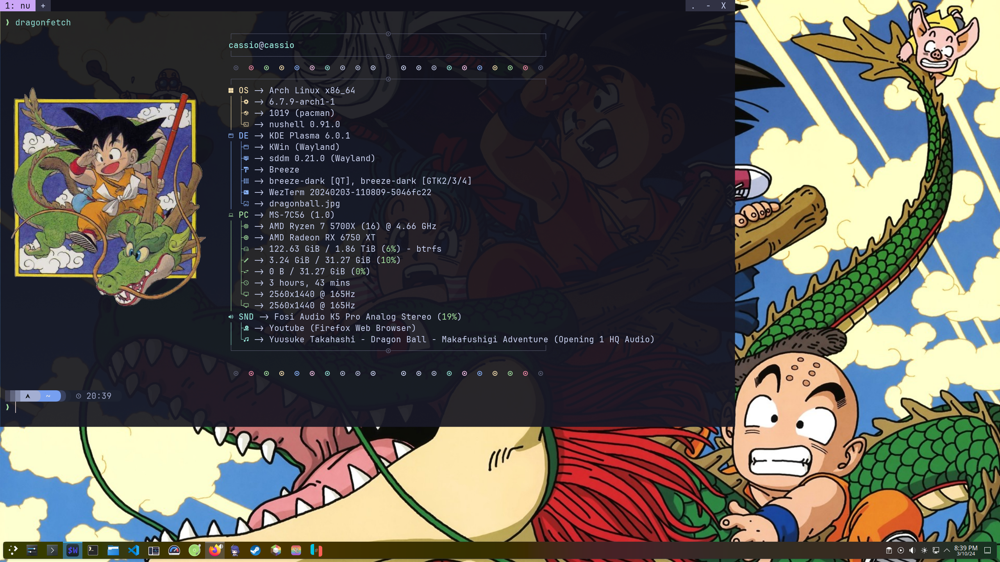

<h1 align="center">
  Wezterm + Nushell + Starship = ❤️
</h1>

<h4 align="center">My crab terminal dotfiles</h4>

  <a href="#about">About</a> •
  <a href="#usage">Usage</a> •
  <a href="#development">Development</a> •
  <a href="#credits">Credits</a> •
  <a href="#license">License</a>

   

  

## About

This repo is just for me tracking the config on another devices.

## Usage

Paste all contents in the [home](/home/) folder in your home folder.

## Credits

Thanks for the open source projects bellow:

- [wezterm](https://github.com/wez/wezterm)
- [nushell](https://github.com/nushell/nushell)
- [starship](https://github.com/starship/starship)

## License

MIT
